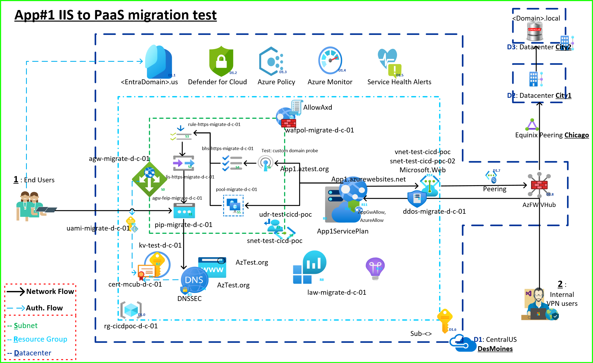

# DBMCUB IIS → PaaS Migration – Right‑hand Architecture Narrative

## 1. Entry Points & User Flows

### 1.1 External Users (Internet)

* Reach the application via the **front‑end Public IP** of **Application Gateway**.
* Public DNS record (A/AAAA or CNAME) resolves the custom domain to this public IP.
* TLS is terminated using the certificate retrieved from **Azure Key Vault**.

### 1.2 Internal Users (Enterprise)

* **Primary path:** same **front‑end Public IP** of Application Gateway (consistent experience, policy enforcement).
* **Bypass path (allowed):** direct access to the **Web App default hostname**. This is permitted by Web App **Access Restrictions** (see §3.3), enabling internal users to reach the Web App **without traversing the firewall**.

---

## 2. Name Resolution, TLS, and Certificates

### 2.1 Public DNS Zone

* The **custom domain** is hosted in a **Public DNS Zone** in the same resource group.
* Records:

  * **A/AAAA** → Application Gateway public IP (for apex or host)
  * **CNAME** → Web App hostname (where applicable)

### 2.2 Certificate Lifecycle

* Certificate is stored as a secret/certificate in **Key Vault**.
* **User‑Assigned Managed Identity (UAMI)** is granted **Get/List** permissions on Key Vault certificates/secrets.
* **Application Gateway** uses the UAMI to **impersonate** and retrieve the certificate for its HTTPS listener.

### 2.3 DNS Security

* **DNS Security** is enabled for the public DNS zone (e.g., DNSSEC/Defender for DNS monitoring).
* **Known limitation:** DNS security does **not currently apply to App Service Domains**; this may be revisited in the future.

---

## 3. Application Gateway (v1) Configuration

### 3.1 Network Placement

* Deployed **inside a dedicated subnet** in a VNet (v1 deployment model).
* **UDR on the App Gateway subnet** must route **Internet‑bound** traffic **directly to the Internet**, **not** to the Virtual Hub. This routing is required for health and outbound dependencies.

### 3.2 Front‑End, Listener, and Rule

* **Front‑End Public IP** is the published ingress for all users.
* **HTTPS Listener** consumes the certificate from Key Vault via the UAMI.
* **Routing Rule** references:

  * **Backend HTTP(S) settings** (see §3.4)
  * **Custom health probe** (see §3.5)
  * **Backend pool** targeting the Web App

### 3.3 Web App Access Restrictions

* Two explicit **allow** entries:

  1. **Application Gateway** → allowed to reach the Web App
  2. **<> Azure Firewall Public IP** → allowed to reach the Web App
* These rules explain how **internal users** can **bypass the firewall** and still reach the Web App directly when needed.

### 3.4 Backend HTTPS Settings

* Configured to use **HTTPS** toward the Web App.
* Bound to the **custom health probe** and **backend pool**.

### 3.5 Custom Health Probe (Must Be Green)

* Probe points to the **custom domain** configured on the Web App (Host header must match).
* Probe success is a **hard requirement** for the rule to send traffic.

---

## 4. Web App (App Service)

### 4.1 Hostnames & Domain

* Web App is bound to the **custom domain**.
* Direct Web App URL remains available for the internal bypass scenario.

### 4.2 Identity & Secrets

* When required, the Web App/UAMI pattern can also be used to retrieve secrets (certificate primarily used by the App Gateway in this design).

---

## 5. Virtual Network, Security, and Monitoring Controls

### 5.1 DDoS Protection

* The VNet has **Azure DDoS Protection** associated; ensure policy and runbooks are in place.

### 5.2 Firewall & WAF Policies

* **Azure Firewall Policy**/**WAF Policy** is attached to Application Gateway as shown in the diagram.
* Operate in **Prevention** or **Detection** as defined by risk appetite; capture logs.

### 5.3 SIEM & Cloud Defender

* Integrate logs with **Microsoft Sentinel** workspace.
* **Defender for Cloud** enabled to surface posture, threat, and compliance signals.

### 5.4 Logging & Telemetry (Recommended)

* **App Gateway**: Access logs, performance logs, firewall logs → Log Analytics.
* **Web App**: AppServiceHTTPLogs, AppServiceConsoleLogs, Diagnostics → Log Analytics.
* **Key Vault**: Audit logs (SecretGet, CertGet) → Log Analytics/SIEM.
* **DNS**: Query analytics/alerts from Defender for DNS (if enabled).
* **DDoS**: Mitigation reports and flow logs.

---

## 6. Data Connectivity Path (Right‑Hand Data Flow)

### 6.1 Network Topology

* The Web App has network reachability to an **Oracle database** hosted **on‑premises (Minneapolis data center)**.
* Path: **Web App** → **peered VNet** → **Virtual Hub** → **ExpressRoute** → **Chicago/St. Paul POPs** → **Minneapolis data center**.

### 6.2 Traffic Considerations

* Ensure required **service endpoints/Private DNS** (if using Private Endpoints elsewhere) and **NSG/UDR** rules permit outbound connections from the Web App’s integration to the database over ExpressRoute.
* Monitor latency and throughput across the vHub and ER circuit; set SLO/SLA thresholds.

---

## 7. End‑to‑End Request Walkthrough

1. **User (External or Internal)** resolves the custom domain → **Public DNS** returns the **App Gateway public IP**.
2. **TLS handshake** occurs at App Gateway using the **Key Vault certificate** retrieved via **UAMI**.
3. Listener → Rule → **Backend HTTPS settings** send the request to the **Web App**.
4. **Custom health probe** stays green by probing the Web App on the **custom domain**.
5. Web App processes the request and, when needed, accesses the **Oracle DB** via **peering → vHub → ExpressRoute**.

---

## 8. Operational Runbook (Key Checks)

* **DNS**: Record(s) exist and resolve globally to the App Gateway public IP.
* **Certificate**: Present in Key Vault; App Gateway UAMI has **Get/List**; listener is bound and valid.
* **Access Restrictions**: Web App allows **App Gateway** and **<> Azure Firewall public IP**.
* **Routing**: App Gateway subnet **UDR** sends Internet traffic **to Internet**, not to the vHub.
* **Probe**: Custom probe status is **Healthy (green)**.
* **WAF/Firewall**: Policy is attached and logging to Log Analytics.
* **DDoS**: Plan enabled and alerts configured.
* **SIEM**: Sentinel analytics rules enabled for App Gateway, Web App, Key Vault, DNS, and DDoS telemetry.
* **Data Path**: ER circuit operational; database reachable from the Web App path.

---

## 9. Known Limitations & Open Items

* **DNS Security** does not currently apply to **App Service Domains**; reassess periodically for platform updates.
* **App Gateway v1** requires VNet placement and specific **UDR** behavior; misconfiguration can cause probe failures or 502s.

---

## 10. Resource Mapping (as seen in the diagram)

* **Application Gateway (v1)** – public frontend, HTTPS listener, rule, backend HTTPS settings, custom probe, backend pool → Web App
* **Public DNS Zone** – A/AAAA/CNAME records for the custom domain
* **Azure Key Vault** – certificate object (e.g., `cert-<>-d-c-01`)
* **User‑Assigned Managed Identity** – used by App Gateway to access Key Vault (e.g., `uami-migrate-d-c-01`)
* **Azure Firewall/WAF Policy** – attached to App Gateway
* **DDoS Protection** – enabled on VNet
* **Virtual Hub + ExpressRoute** – connectivity to Minneapolis data center / Oracle DB
